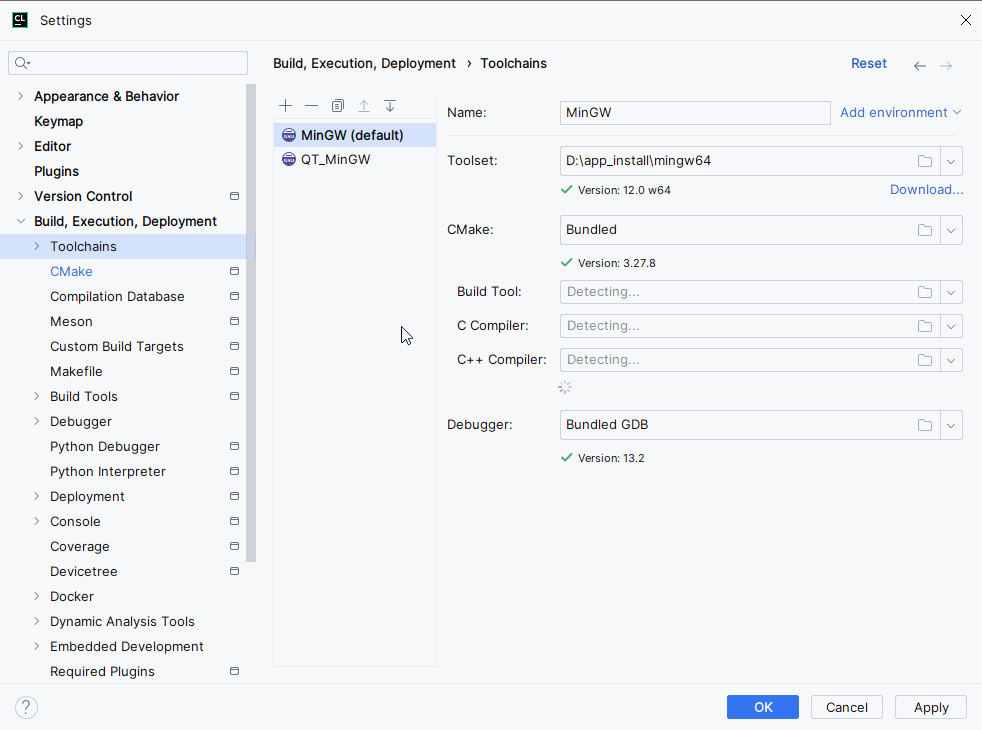

1. [参考文章](https://zhuanlan.zhihu.com/p/693626476)，顶层的CMakeLists.txt和colcon.cmake文件都来自于[github](https://github.com/kai-waang/colcon-toplevel-cmake);
2. 按实际修改 active_env.bat，并将其配置为`setting->build->toolchains`中的`Environment file`,如下配置;

3. 修改`CMakeLists.txt`, 修改colcon.cmake文件路径即可；
4. 目前环境配置完成后，暂时无法进行进行debug，debug模式下编译会有错误；
5. **在此目录下（ros_cpp_ws），若使用colcon build 命令，会出现报错，可以只保留`src`，删错其它文件，不影响colcon命令编译。**